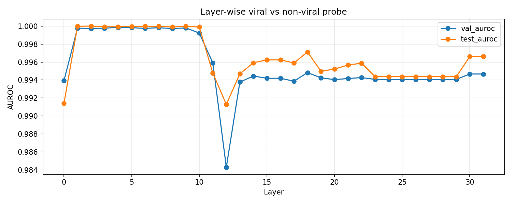

# Evo-1 Viral-Family Representation Localization

## Phase 1 Pilot: Layer-wise Probing of Evo-1 Hidden Representations

This repository contains a Phase 1 pilot pipeline for **capability localization in Evo-1 genomic foundation models**.

The goal of this stage is to identify where viral-family sequence information is most linearly accessible inside Evo-1’s hidden representations. This is not a viral classifier project and does not study virulence, infectivity, pathogenicity, host range, or viral generation. Instead, the focus is **taxonomy-level representation probing**: whether frozen Evo-1 activations can separate viral sequences from non-viral sequences.

In this pilot, I use a **viral-vs-plasmid RefSeq dataset** and train layer-wise L2 logistic probes on mean-pooled Evo-1 activations.

---

## Main Result

The current pilot result shows that viral/plasmid separability is already highly accessible in the earliest Evo-1 layers.

### Layer-wise Probe AUROC



**Figure:** Layer-wise validation AUROC and test AUROC across all 32 Evo-1 layers.

The strongest signal appears in the early layers:

- Layer 0 already reaches **0.9914 test AUROC**
- Layer 1 reaches **1.0000 test AUROC**
- Layer 2 reaches **1.0000 test AUROC**
- Layers 1–10 form a near-perfect AUROC plateau
- Layer 12 is the main local validation AUROC valley
- Attention layers at 8, 16, and 24 do not form special AUROC peaks in this pilot

The current pilot suggests that viral/plasmid information is most linearly accessible in the earliest Evo-1 layers, especially Layers 1–10.

---

## Key Probe Metrics

| Layer | Val AUROC | Test AUROC | Val Acc | Test Acc | Interpretation |
|---:|---:|---:|---:|---:|---|
| 0 | 0.9939 | 0.9914 | 0.9625 | 0.9525 | Very early separability |
| 1 | 0.9998 | 1.0000 | 0.9950 | 0.9925 | Near-perfect probe performance |
| 2 | 0.9997 | 1.0000 | 0.9925 | 0.9925 | Peak test AUROC |
| 4 | 0.9998 | 0.9999 | 0.9950 | 0.9950 | Peak validation AUROC |
| 8 | 0.9997 | 0.9999 | 0.9925 | 0.9950 | Attention layer; no special spike |
| 10 | 0.9992 | 0.9999 | 0.9925 | 0.9900 | End of early high-AUROC plateau |
| 12 | 0.9843 | 0.9913 | 0.9625 | 0.9750 | Local validation AUROC valley |
| 13–22 | ≈0.994 | ≈0.996 | ≈0.962 | ≈0.974 | Stable later region |
| 23–29 | 0.9941 | 0.9944 | 0.9650 | 0.9750 | Duplicated metrics; shown for completeness |
| 30–31 | 0.9947 | 0.9966 | 0.9600 | 0.9775 | Pairwise duplicated metrics |

Full layer-wise metrics are available in:

```text
results/probe_metrics_by_layer.csv
```

---

## Baseline Comparison

To test whether the separation can be explained by simple nucleotide composition, I also ran a GC + 1-gram logistic regression baseline.

This baseline uses only six features:

```text
GC content + A/C/G/T/N frequencies
```

No Evo representations are used in this baseline.

| Method | Features | Test Acc | Test AUROC |
|---|---|---:|---:|
| GC + 1-gram logistic regression | GC + A/C/G/T/N frequency | 0.6400 | 0.6854 |
| Evo Layer 0 probe | Mean-pooled Evo activation | 0.9525 | 0.9914 |
| Evo Layer 2 probe | Mean-pooled Evo activation | 0.9925 | 1.0000 |

The GC + 1-gram baseline reaches **0.6854 test AUROC**, while Evo Layer 0 already reaches **0.9914 test AUROC**. This gap suggests that Evo-1 hidden representations contain substantially stronger viral/plasmid separability than single-nucleotide composition alone.

Baseline metrics are available in:

```text
results/gc_1gram_metrics.csv
```

---

## Current Completed Work

This repository includes the completed Phase 1 pilot workflow:

- Evo-1 checkpoint loading and forward inference test
- RefSeq-based viral-vs-plasmid pilot manifest construction
- Layer-wise activation extraction from all 32 Evo-1 blocks
- Mask-aware mean pooling into 4096-dimensional sequence representations
- 32 layer-wise L2-regularized logistic probes
- Probe coefficient, intercept, selected C value, accuracy, and AUROC outputs
- GC + 1-gram logistic regression baseline
- Layer-wise AUROC visualization
- Full 32-layer metrics table

---

## Dataset

The current results are based on a viral-vs-plasmid pilot dataset.

| Item | Value |
|---|---:|
| Data source | NCBI RefSeq |
| Viral sequences | 2,000 |
| Plasmid sequences | 2,000 |
| Total sequences | 4,000 |
| Window length | 2,048 bp |
| Train / Val / Test | 3,200 / 400 / 400 |
| Split ratio | 80% / 10% / 10% |
| Random seed | 42 |
| Label definition | viral = 1, plasmid = 0 |

Exact duplicate checking was performed across the train, validation, and test splits. All 4,000 sequences are unique, so the current AUROC values are not inflated by exact duplicate sequence leakage.

---

## Model

The probing pipeline uses Evo-1 as a frozen genomic foundation model.

| Model property | Value |
|---|---:|
| Model family | Evo-1 |
| Architecture | StripedHyena |
| Number of layers | 32 |
| Hidden dimension | 4,096 |
| Hyena layers | 29 |
| Attention layers | 8, 16, 24 |
| Input resolution | character / nucleotide-level tokenization |

Evo-1 is not a standard Transformer. Most layers are Hyena convolutional operators, with only three attention layers. This matters for interpretation: the strongest separability appears very early, and the attention layers do not form special AUROC peaks in the current pilot.

---

## Pipeline

The full pilot pipeline is organized into four main steps.

```text
Step 1: Build manifest
RefSeq FASTA files
→ clean A/C/G/T/N
→ crop or sample 2048-bp windows
→ assign labels and splits
→ write manifest.csv

Step 2: Extract activations
DNA sequences
→ frozen Evo-1 forward pass
→ forward hooks on all 32 blocks
→ mask-aware mean pooling
→ 4096-dimensional vector per sequence per layer

Step 3: Train probes
Layer-wise features
→ L2 logistic regression
→ C-grid search over {0.1, 1, 10}
→ select best C by validation AUROC
→ save probe metrics and probe weights

Step 4: Plot results
probe_metrics_by_layer.csv
→ layer-wise validation/test AUROC curve
```

---

## Method

For each sequence and each Evo-1 layer, the hidden state is a token-level representation:

$$
H_l \in \mathbb{R}^{T \times 4096}
$$

where \(T\) is the sequence length and 4096 is the hidden dimension.

I use mask-aware mean pooling to convert token-level hidden states into one fixed-length sequence representation:

$$
h_l = \frac{1}{T}\sum_{t=1}^{T} H_{l,t}
$$

This produces one 4096-dimensional vector per sequence per layer.

For each layer, I then train an L2-regularized logistic regression probe:

```text
Input: mean-pooled activation from layer l
Output: viral vs plasmid label
Metric: AUROC and accuracy
C-grid: 0.1, 1, 10
Selection criterion: validation AUROC
```

The linear probe is intentionally simple. The goal is not to maximize classifier complexity, but to test whether viral/plasmid information is linearly accessible in the frozen representation space.

---

## Interpretation

The main interpretation from the pilot result is:

> Viral/plasmid separability is already highly linearly accessible in the earliest Evo-1 layers.

This is notable because one might expect higher-level biological or taxonomic information to emerge in middle or later layers. Instead, Layer 0 is already above 0.99 test AUROC, and Layers 1–10 form a near-perfect plateau.

A plausible explanation is that Hyena convolutional layers can aggregate sequence composition and higher-order motif statistics very early. The GC + 1-gram baseline already shows that simple nucleotide composition carries some signal, but the large gap between GC + 1-gram and Evo Layer 0 indicates that Evo is extracting richer sequence features than single-base frequencies.

The attention layers do not show special peaks in this pilot. Layer 8 is high, but it follows the broader early-layer plateau. Layers 16 and 24 do not create clear new peaks in the current plotted results.

---

## Probe Weight Files

Each trained probe produces a `.npz` file containing:

| Field | Meaning |
|---|---|
| `coef` | 1 × 4096 linear direction in layer representation space |
| `intercept` | Logistic regression intercept |
| `C` | Selected regularization strength |

The probe coefficient vector can be interpreted as the linear direction that increases the viral logit in that layer’s representation space. These vectors are useful for analyzing the geometry of layer-wise separability and can be reused as candidate steering directions in follow-up experiments.

---

## Notes on Result Reliability

The early-layer results are the main conclusion of this pilot. The late-layer rows are included for completeness, but some late-layer metrics show exact duplication:

- Layers 23–29 have identical metrics.
- Layers 15–16 are duplicated.
- Layers 30–31 are duplicated.

These rows should not be used as the main basis for interpretation. The early-layer localization pattern, especially Layers 1–10, does not depend on the duplicated late-layer region.

---

## Repository Structure

```text
evo1-viral-capability-localization/
├── README.md
├── run.sh
├── run_bacteria_rerun.sh
├── phase1/
│   ├── download_refseq.py
│   ├── extract_features.py
│   ├── train_probes.py
│   ├── baseline_gc_1gram.py
│   ├── plot_metrics.py
│   └── utils.py
├── results/
│   ├── probe_metrics_by_layer.csv
│   └── gc_1gram_metrics.csv
└── docs/
    └── assets/
        └── probe_metrics.png
```

---

## Key Files

| File | Description |
|---|---|
| `run.sh` | End-to-end viral-vs-plasmid Phase 1 pilot pipeline |
| `run_bacteria_rerun.sh` | Optional viral-vs-bacteria rerun script using a separate output directory |
| `phase1/download_refseq.py` | Downloads RefSeq FASTA files and builds the manifest |
| `phase1/extract_features.py` | Extracts mean-pooled 32-layer Evo-1 activations |
| `phase1/train_probes.py` | Trains layer-wise L2 logistic probes |
| `phase1/baseline_gc_1gram.py` | Runs GC + 1-gram baseline |
| `phase1/plot_metrics.py` | Generates layer-wise AUROC visualization |
| `phase1/utils.py` | Shared utilities for manifest reading, sequence cleaning, batching, and feature writing |
| `results/probe_metrics_by_layer.csv` | Full 32-layer probe metrics |
| `results/gc_1gram_metrics.csv` | Baseline metrics |
| `docs/assets/probe_metrics.png` | Layer-wise AUROC plot shown in README |

---

## Data and Safety Note

This repository is intended for code and aggregate result sharing.

It should not include:

- model checkpoints
- raw FASTA files
- raw viral or plasmid sequences
- large activation feature chunks
- large `.npy` feature matrices
- private server paths
- recovery attack checkpoints
- sensitive generated sequences

The current repository focuses on Phase 1 representation probing and aggregate metrics.

---

## References

- Nguyen et al. 2024. *Sequence modeling and design from molecular to genome scale with Evo*. Science.
- Brixi et al. 2025. *Genome modeling and design across all domains of life with Evo 2*. bioRxiv.
